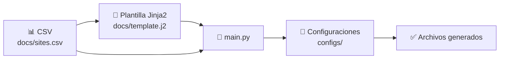

# ⚙️ Generación Automatizada de Configuraciones con Jinja2 y GitHub Actions

> **Proyecto:** Automatización de configuraciones mediante plantillas Jinja2  
> **Lenguaje:** Python 3  
> **Enfoque:** DevOps · Automatización · CI/CD · GitHub Actions


---

## 📖 Descripción

Este proyecto utiliza **Python 3** y **Jinja2** para automatizar la generación de archivos de configuración a partir de plantillas.

La información específica de cada sitio se obtiene desde una base de datos en formato **CSV**, mientras que la estructura base de configuración se define mediante una plantilla **Jinja2**.  
El proceso permite generar múltiples configuraciones de forma automática, ordenada y reproducible.

---

## 🎯 Objetivo

Automatizar la creación de configuraciones mediante un flujo DevOps que integre:

- 📄 Plantillas Jinja2.
- 📊 Datos estructurados en CSV.
- 🐍 Script Python.
- ⚙️ Validación automática mediante GitHub Actions.
- 📁 Generación de archivos de salida en el directorio `configs`.

---

## 📁 Estructura del proyecto

```text
.
├── .github/
│   └── workflows/
│       └── python-ci.yml
├── configs/
├── docs/
│   ├── sites.csv
│   └── template.j2
├── main.py
├── requirements.txt
└── README.md
```

---

## 🧩 Funcionamiento general



---

## ⚙️ Instalación local

Clone el repositorio:

```bash
git clone <URL_DEL_REPOSITORIO>
cd <NOMBRE_DEL_REPOSITORIO>
```

Cree un entorno virtual:

```bash
python3 -m venv venv
source venv/bin/activate
```

Instale las dependencias:

```bash
pip install --upgrade pip
pip install -r requirements.txt
```

---

## 🚀 Ejecución local

Ejecute el script principal:

```bash
python3 main.py
```

Al finalizar, las configuraciones generadas se almacenarán en:

```text
configs/
```

---

## ⚙️ Integración con GitHub Actions

Este proyecto puede ejecutarse automáticamente mediante **GitHub Actions** cada vez que se realice un `push` o un `pull request` hacia la rama `main`.

El pipeline realiza las siguientes acciones:

1. 📥 Descarga el contenido del repositorio.
2. 🐍 Configura Python.
3. 📦 Crea un ambiente virtual.
4. 📚 Instala las dependencias desde `requirements.txt`.
5. 🚀 Ejecuta `main.py`.
6. 🧪 Ejecuta pruebas con `pytest` si existen pruebas disponibles.

---

## 📄 Workflow sugerido

Archivo:

```text
.github/workflows/python-ci.yml
```

```yaml
name: Python Jinja2 CI

on:
  push:
    branches:
      - main

  pull_request:
    branches:
      - main

jobs:
  generate-configs:
    runs-on: ubuntu-latest

    steps:
      - name: 📥 Descargar repositorio
        uses: actions/checkout@v4

      - name: 🐍 Configurar Python
        uses: actions/setup-python@v6
        with:
          python-version: "3.12"

      - name: 📦 Crear ambiente virtual e instalar dependencias
        run: |
          python3 -m venv venv
          ./venv/bin/python -m pip install --upgrade pip
          ./venv/bin/pip install -r requirements.txt

      - name: ⚙️ Ejecutar generación de configuraciones
        run: |
          ./venv/bin/python main.py

      - name: 🧪 Ejecutar pruebas
        run: |
          ./venv/bin/python -m pytest -v
```

---

## 📌 Resultado esperado

Si el workflow finaliza correctamente, GitHub Actions mostrará:

```text
✅ Success
```

Esto significa que:

- El repositorio fue descargado correctamente.
- Las dependencias fueron instaladas.
- El script `main.py` se ejecutó sin errores.
- Las configuraciones fueron generadas correctamente.

---

## ❌ Errores frecuentes

| Error | Posible causa | Solución |
|------|---------------|----------|
| `ModuleNotFoundError` | Dependencias no instaladas | Verificar `requirements.txt` |
| `FileNotFoundError` | No existe CSV o plantilla | Revisar rutas dentro de `docs/` |
| `jinja2.exceptions.TemplateNotFound` | Plantilla no encontrada | Confirmar nombre y ubicación del archivo `.j2` |
| `pytest: command not found` | Pytest no está instalado | Agregar `pytest` a `requirements.txt` |

---

## 🎓 Enfoque DevOps

Este proyecto permite aplicar principios fundamentales de DevOps:

- ✅ Automatización de tareas repetitivas.
- ✅ Infraestructura como Código.
- ✅ Control de versiones.
- ✅ Validación continua.
- ✅ Reproducibilidad del proceso.
- ✅ Ejecución automatizada mediante pipelines CI/CD.

---

## 📚 Comandos principales

| Acción | Comando |
|-------|---------|
| Instalar dependencias | `pip install -r requirements.txt` |
| Ejecutar script | `python3 main.py` |
| Ejecutar pruebas | `python3 -m pytest -v` |
| Ejecutar pipeline | `git push origin main` |

---

## 🏁 Conclusión

Este laboratorio demuestra cómo integrar **Python**, **Jinja2** y **GitHub Actions** para automatizar la generación de configuraciones de forma controlada, repetible y alineada con buenas prácticas DevOps.
